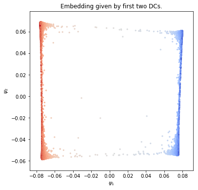

2D Four-well potential
======================

.. code:: ipython3

    import matplotlib.pyplot as plt
    import numpy as np
    
    from mpl_toolkits.mplot3d import Axes3D
    from pydiffmap import diffusion_map as dm
    
    %matplotlib inline

Load sampled data: discretized Langevin dynamics at temperature T=1,
friction 1, and time step size dt=0.01, with double-well potentials in x
and y, with higher barrier in y.

.. code:: ipython3

    X=np.load('Data/4wells_traj.npy')
    print(X.shape)

.. parsed-literal::

    (9900, 2)

.. code:: ipython3

    def DW1(x):
            return 2.0*(np.linalg.norm(x)**2-1.0)**2
    
    def DW2(x):
            return 4.0*(np.linalg.norm(x)**2-1.0)**2
    
    def DW(x):
        return DW1(x[0]) + DW1(x[1])
    
    from matplotlib import cm
    
    mx=5
    
    xe=np.linspace(-mx, mx, 100)
    ye=np.linspace(-mx, mx, 100)
    energyContours=np.zeros((100, 100))
    for i in range(0,len(xe)):
                for j in range(0,len(ye)):
                    xtmp=np.array([xe[i], ye[j]] )
                    energyContours[j,i]=DW(xtmp)
    
    levels = np.arange(0, 10, 0.5)
    plt.contour(xe, ye, energyContours, levels, cmap=cm.coolwarm)
    plt.scatter(X[:,0], X[:,1], s=5, c='k')
    plt.xlabel('X')
    plt.ylabel('Y')
    plt.xlim([-2,2])
    plt.ylim([-2,2])
    plt.show()

Compute diffusion map embedding
-------------------------------

.. code:: ipython3

    mydmap = dm.DiffusionMap.from_sklearn(n_evecs = 2, epsilon = .1, alpha = 0.5, k=400, metric='euclidean')
    dmap = mydmap.fit_transform(X)

.. parsed-literal::

    0.1 eps fitted

Visualization
-------------

We plot the first two diffusion coordinates against each other, colored
by the x coordinate

.. code:: ipython3

    from pydiffmap.visualization import embedding_plot
    
    embedding_plot(mydmap, scatter_kwargs = {'c': X[:,0], 's': 5, 'cmap': 'coolwarm'})
    
    plt.show()

.. image:: output_8_0.png

.. code:: ipython3

    #from matplotlib import cm
    #plt.scatter(dmap[:,0], dmap[:,1], c=X[:,0], s=5, cmap=cm.coolwarm)
    
    #clb=plt.colorbar()
    #clb.set_label('X coordinate')
    #plt.xlabel('First dominant eigenvector')
    #plt.ylabel('Second dominant eigenvector')
    #plt.title('Diffusion Map Embedding')
    
    #plt.show()

We visualize the data again, colored by the first eigenvector this time.

.. code:: ipython3

    from pydiffmap.visualization import data_plot
    
    data_plot(mydmap, scatter_kwargs = {'s': 5, 'cmap': 'coolwarm'})
    plt.show()

Target measure diffusion map
----------------------------

Compute Target Measure Diffusion Map with target distribution pi(q) =
exp(-beta V(q)) with inverse temperature beta = 1. TMDmap can be seen as
a special case where the weights are the target distribution, and
alpha=1.

.. code:: ipython3

    V=DW
    beta=1
    change_of_measure = lambda x: np.exp(-beta * V(x))
    mytdmap = dm.TMDmap(alpha=1.0, n_evecs = 2, epsilon = .1, 
                        k=400, change_of_measure=change_of_measure)
    tmdmap = mytdmap.fit_transform(X)

.. parsed-literal::

    0.1 eps fitted

.. code:: ipython3

    embedding_plot(mytdmap, scatter_kwargs = {'c': X[:,0], 's': 5, 'cmap': 'coolwarm'})
    
    plt.show()

From the sampling at temperature 1/beta =1, we can compute diffusion map
embedding at lower temperature T\_low = 1/beta\_low using TMDmap with
target measure pi(q) = exp(-beta\_low V(q)). Here we set beta\_low = 10,
and use the data obtained from sampling at higher temperature, i.e.
pi(q) = exp(-beta V(q)) with beta = 1.

.. code:: ipython3

    V=DW
    beta_2=10
    change_of_measure_2 = lambda x: np.exp(-beta_2 * V(x))
    mytdmap2 = dm.TMDmap(alpha=1.0, n_evecs = 2, epsilon = .1, 
                                           k=400, change_of_measure=change_of_measure_2)
    tmdmap2 = mytdmap2.fit_transform(X)

.. parsed-literal::

    0.1 eps fitted

.. code:: ipython3

    embedding_plot(mytdmap2, scatter_kwargs = {'c': X[:,0], 's': 5, 'cmap': 'coolwarm'})
    
    plt.show()

Kernel density estimate
-----------------------

We can compute kernel density estimate using kde used in the diffusion
map computation.

.. code:: ipython3

    plt.scatter(X[:,0], X[:,1], c = mytdmap.q, s=5, cmap=cm.coolwarm)
    
    clb=plt.colorbar()
    clb.set_label('q')
    plt.xlabel('First dominant eigenvector')
    plt.ylabel('Second dominant eigenvector')
    plt.title('TMDmap Embedding, beta=1')
    
    plt.show()

Now we check how well we can approximate the target distribution by the
formula in the paper (left dominant eigenvector times KDE).

.. code:: ipython3

    import scipy.sparse.linalg as spsl
    L = mytdmap.L
    [evals, evecs] = spsl.eigs(L.transpose(),k=1, which='LR')
    
    phi = np.real(evecs.ravel())

.. code:: ipython3

    q_est = phi*mytdmap.q
    q_est = q_est/sum(q_est)
    
    target_distribution = np.array([change_of_measure(Xi) for Xi in X])
    q_exact = target_distribution/sum(target_distribution)
    print(np.linalg.norm(q_est - q_exact,1))

.. parsed-literal::

    0.040391461721631335

visualize both. there is no visible difference.

.. code:: ipython3

    plt.figure(figsize=(16,6))
    
    ax = plt.subplot(121)
    SC1 = ax.scatter(X[:,0], X[:,1], c = q_est, s=5, cmap=cm.coolwarm, vmin=0, vmax=2E-4)
    
    ax.set_xlabel('x')
    ax.set_ylabel('y')
    ax.set_title('estimate of pi')
    plt.colorbar(SC1, ax=ax)
    
    
    ax2 = plt.subplot(122)
    SC2 = ax2.scatter(X[:,0], X[:,1], c = q_exact, s=5, cmap=cm.coolwarm, vmin=0, vmax=2E-4)
    plt.colorbar(SC2, ax=ax2)
    
    
    ax2.set_xlabel('x')
    ax2.set_ylabel('y')
    ax2.set_title('exact pi')
    
    plt.show()

.. image:: output_26_0.png

