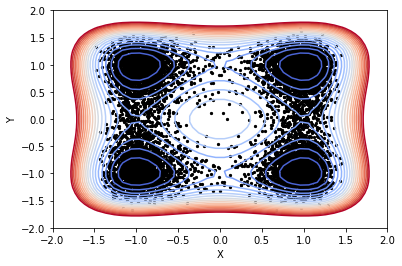
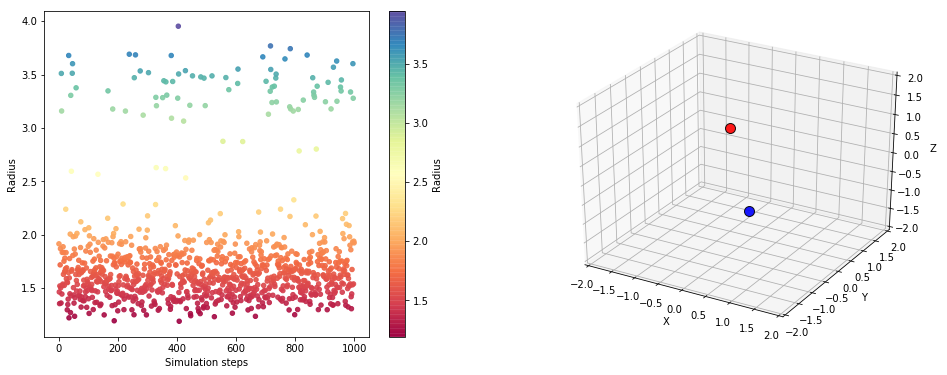
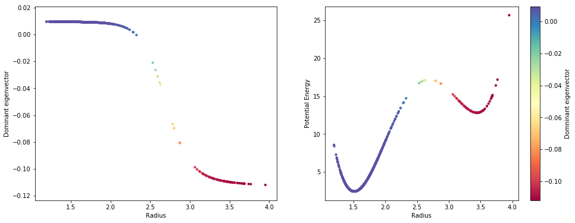

Diffusion maps with general metric
==================================

In this notebook, we illustrate how to use an optional metric in the
diffusion maps embedding.

.. code:: python

    import matplotlib.pyplot as plt
    import numpy as np
    
    from mpl_toolkits.mplot3d import Axes3D
    from pydiffmap import diffusion_map as dm
    
    %matplotlib inline

2D Four-well potential
----------------------

Load sampled data: discretized Langevin dynamics at temperature T=1,
friction 1, and time step size dt=0.01, with double-well potentials in x
and y, with higher barrier in y.

.. code:: python

    X=np.load('Data/4wells_traj.npy')

.. code:: python

    def DW1(x):
            return 2.0*(np.linalg.norm(x)**2-1.0)**2
    
    def DW2(x):
            return 4.0*(np.linalg.norm(x)**2-1.0)**2
    
    def DW(x):
        return DW1(x[0]) + DW1(x[1])
    
    from matplotlib import cm
    
    mx=5
    
    xe=np.linspace(-mx, mx, 100)
    ye=np.linspace(-mx, mx, 100)
    energyContours=np.zeros((100, 100))
    for i in range(0,len(xe)):
                for j in range(0,len(ye)):
                    xtmp=np.array([xe[i], ye[j]] )
                    energyContours[j,i]=DW(xtmp)
    
    levels = np.arange(0, 10, 0.5)
    plt.contour(xe, ye, energyContours, levels, cmap=cm.coolwarm)
    plt.scatter(X[:,0], X[:,1], s=5, c='k')
    plt.xlabel('X')
    plt.ylabel('Y')
    plt.xlim([-2,2])
    plt.ylim([-2,2])
    plt.show()

.. code:: python

    
    def periodicMetric(v1, v2):
        
        upperLimitPBC=1
        lowerLimitPBC=-1
        
        BoxLength = upperLimitPBC - lowerLimitPBC
            
        v = v1 - v2
        
        v = v - BoxLength*np.floor(v / BoxLength)
        
            
        return np.linalg.norm(v)

Compute diffusion map embedding

.. code:: python

    mydmap = dm.DiffusionMap(n_evecs = 2, epsilon = .2, alpha = 0.5, k=200, metric=periodicMetric)
    
    dmap = mydmap.fit_transform(X)

.. code:: python

    from pydiffmap.visualization import embedding_plot, data_plot
    
    embedding_plot(mydmap, scatter_kwargs = {'s': 5, 'c': X[:,0], 'cmap': 'coolwarm'})
    plt.show()

.. image:: output_10_0.png

Dimer trajectory
----------------

We import trajectory of two particles connected by a double-well
potential, which is a function of a radius: V(r) = V_DW(r). The dimer
was simulated at 300K with Langevin dynamics using OpenMM. The obvious
collective variable is the radius case and we demonstrate how the first
dominant eigenvector obtained from the diffusion map clearly correlates
with this reaction coordinate. As a metric, we use the root mean square
deviation (RMSD) from the package
https://pypi.python.org/pypi/rmsd/1.2.5.

.. code:: python

    traj=np.load('Data/dimer_trajectory.npy')
    energy=np.load('Data/dimer_energy.npy')
    print('Loaded trajectory of '+repr(len(traj))+' steps of dimer molecule: '+repr(traj.shape[1])+' particles in dimension '+repr(traj.shape[2])+'.')

.. parsed-literal::

    Loaded trajectory of 1000 steps of dimer molecule: 2 particles in dimension 3.

.. code:: python

    def compute_radius(X):
        return np.linalg.norm(X[:,0,:]-X[:,1,:], 2, axis=1)
    
    fig = plt.figure(figsize=[16,6])
    ax = fig.add_subplot(121)
    
    radius= compute_radius(traj)
    cax2 = ax.scatter(range(len(radius)), radius, c=radius, s=20,alpha=0.90,cmap=plt.cm.Spectral)
    cbar = fig.colorbar(cax2)
    cbar.set_label('Radius')
    ax.set_xlabel('Simulation steps')
    ax.set_ylabel('Radius')
    
    
    ax2 = fig.add_subplot(122, projection='3d')
    
    L=2
    
    i=0
    
    ax2.scatter(traj[i,0,0], traj[i,0,1], traj[i,0,2], c='b', s=100, alpha=0.90, edgecolors='none', depthshade=True,)
    ax2.scatter(traj[i,1,0], traj[i,1,1], traj[i,1,2], c='r', s=100, alpha=0.90, edgecolors='none',  depthshade=True,)
        
    ax2.set_xlim([-L, L])
    ax2.set_ylim([-L, L])
    ax2.set_zlim([-L, L])
    
    ax2.set_xlabel('X')
    ax2.set_ylabel('Y')
    ax2.set_zlabel('Z')
       
    plt.show()

.. code:: python

    # download from https://pypi.python.org/pypi/rmsd/1.2.5
    import rmsd
    
    
    def myRMSDmetric(arr1, arr2):
        """
        This function is built under the assumption that the space dimension is 3!!!
        Requirement from sklearn radius_neighbors_graph: The callable should take two arrays as input and return one value indicating the distance between them.
         Input: One row from reshaped XYZ trajectory as number of steps times nDOF
         Inside: Reshape to XYZ format and apply rmsd as r=rmsd(X[i], X[j])
         Output: rmsd distance
        """
        
        nParticles = len(arr1) / 3;
        assert (nParticles == int(nParticles))
    
        X1 = arr1.reshape(int(nParticles), 3 )
        X2 = arr2.reshape(int(nParticles), 3 )
    
        X1 = X1 -  rmsd.centroid(X1)
        X2 = X2 -  rmsd.centroid(X2)
    
        return rmsd.kabsch_rmsd(X1, X2)
    

Compute diffusion map embedding using the rmsd metric from above.

.. code:: python

    epsilon=0.1
    
    Xresh=traj.reshape(traj.shape[0], traj.shape[1]*traj.shape[2])
    mydmap = dm.DiffusionMap(n_evecs = 1, epsilon = epsilon, alpha = 0.5, k=1000, metric=myRMSDmetric)
    dmap = mydmap.fit_transform(Xresh)
    

Plot the dominant eigenvector over radius, to show the correlation with
this collective variable.

.. code:: python

    evecs = mydmap.evecs
    
    fig = plt.figure(figsize=[16,6])
    ax = fig.add_subplot(121)
    
    ax.scatter(compute_radius(traj), evecs[:,0], c=evecs[:,0], s=10, cmap=plt.cm.Spectral)
    ax.set_xlabel('Radius')
    ax.set_ylabel('Dominant eigenvector')
    
    ax2 = fig.add_subplot(122)
    #
    cax2 = ax2.scatter(compute_radius(traj), energy, c=evecs[:,0], s=10, cmap=plt.cm.Spectral)
    ax2.set_xlabel('Radius')
    ax2.set_ylabel('Potential Energy')
    cbar = fig.colorbar(cax2)
    cbar.set_label('Domninant eigenvector')
    plt.show()

