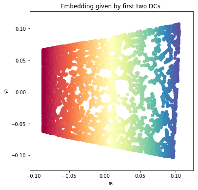
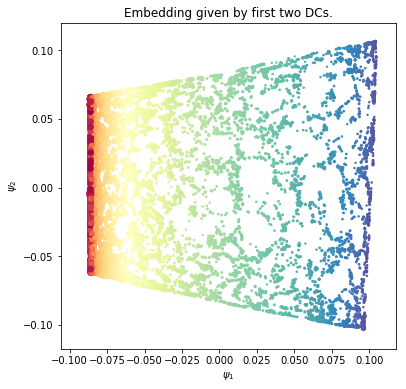
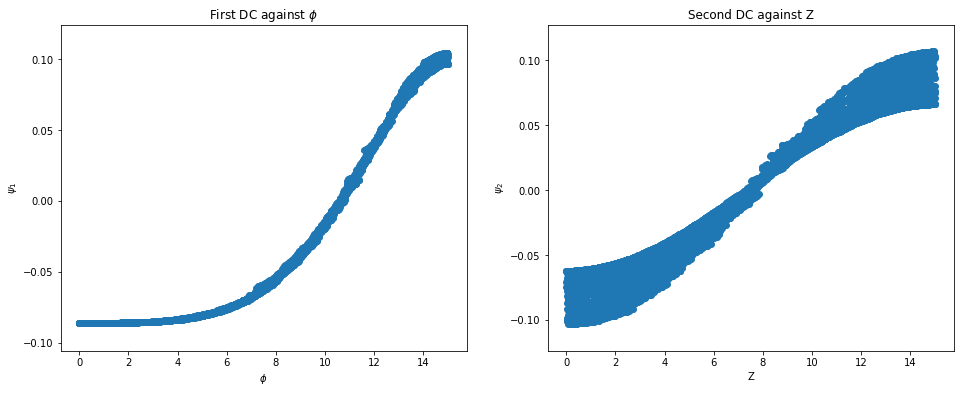

The classic swiss roll data set
===============================

author: Ralf Banisch

We demonstrate the usage of the diffusion\_map class on a
two-dimensional manifold embedded in :math:`\mathbb{R}^3`.

.. code:: ipython3

    # import some necessary functions for plotting as well as the diffusion_map class from pydiffmap.
    import matplotlib.pyplot as plt
    import numpy as np
    
    from mpl_toolkits.mplot3d import Axes3D
    from pydiffmap import diffusion_map as dm
    
    %matplotlib inline

Create Data
-----------

We create the dataset: A noisy sampling of the twodimensional "swiss
roll" embedded in :math:`\mathbb{R}^3`. The sampling is such that the
density of samples decreases with the distance from the origin
(non-uniform sampling).

In order to be handled correctly by the diffusion\_map class, we must
ensure the data is a numpy array of shape (n\_points, n\_features).

.. code:: ipython3

    # set parameters
    length_phi = 15   #length of swiss roll in angular direction
    length_Z = 15     #length of swiss roll in z direction
    sigma = 0.1       #noise strength
    m = 10000         #number of samples
    
    # create dataset
    phi = length_phi*np.random.rand(m)
    xi = np.random.rand(m)
    Z = length_Z*np.random.rand(m)
    X = 1./6*(phi + sigma*xi)*np.sin(phi)
    Y = 1./6*(phi + sigma*xi)*np.cos(phi)
    
    swiss_roll = np.array([X, Y, Z]).transpose()
    
    # check that we have the right shape
    print(swiss_roll.shape)

.. parsed-literal::

    (10000, 3)

Run pydiffmap
-------------

Now we initialize the diffusion map object and fit it to the dataset.
Since we are interested in only the first two diffusion coordinates we
set n\_evecs = 2, and since we want to unbias with respect to the
non-uniform sampling density we set alpha = 1.0. The epsilon parameter
controls the scale and needs to be adjusted to the data at hand. The k
parameter controls the neighbour lists, a smaller k will increase
performance but decrease accuracy.

.. code:: ipython3

    # initialize Diffusion map object.
    neighbor_params = {'n_jobs': -1, 'algorithm': 'ball_tree'}
    
    mydmap = dm.DiffusionMap.from_sklearn(n_evecs=2, k=200, epsilon='bgh', alpha=1.0, neighbor_params=neighbor_params)
    # fit to data and return the diffusion map.
    dmap = mydmap.fit_transform(swiss_roll)

.. parsed-literal::

    0.015625000000000007 eps fitted

.. code:: ipython3

    mydmap.epsilon_fitted

.. parsed-literal::

    0.015625000000000007

Visualization
-------------

We show the original data set on the right, with points colored
according to the first diffusion coordinate. On the left, we show the
diffusion map embedding given by the first two diffusion coordinates.
Points are again colored according to the first diffusion coordinate,
which seems to parameterize the :math:`\phi` direction. We can see that
the diffusion map embedding 'unwinds' the swiss roll.

.. code:: ipython3

    from pydiffmap.visualization import embedding_plot, data_plot
    
    embedding_plot(mydmap, scatter_kwargs = {'c': dmap[:,0], 'cmap': 'Spectral'})
    data_plot(mydmap, dim=3, scatter_kwargs = {'cmap': 'Spectral'})
    
    plt.show()

.. image:: output_8_1.png

To get a bit more information out of the embedding, we can scale the
points according to the numerical estimate of the sampling density
(mydmap.q), and color them according to their location in the phi
direction. For comparison, we color the original data set according to
:math:`\phi` this time.

.. code:: ipython3

    from pydiffmap.visualization import embedding_plot, data_plot
    
    embedding_plot(mydmap, scatter_kwargs = {'c': phi, 's': mydmap.q, 'cmap': 'Spectral'})
    data_plot(mydmap, dim=3, scatter_kwargs = {'cmap': 'Spectral'})
    plt.show()

.. image:: output_10_1.png

We can see that points near the center of the swiss roll, where the
winding is tight, are closer together in the embedding, while points
further away from the center are more spaced out. Let's check how the
first two diffusion coordinates correlate with :math:`\phi` and
:math:`Z`.

.. code:: ipython3

    print('Correlation between \phi and \psi_1')
    print(np.corrcoef(dmap[:,0], phi))
    
    plt.figure(figsize=(16,6))
    ax = plt.subplot(121)
    ax.scatter(phi, dmap[:,0])
    ax.set_title('First DC against $\phi$')
    ax.set_xlabel(r'$\phi$')
    ax.set_ylabel(r'$\psi_1$')
    ax.axis('tight')
    
    print('Correlation between Z and \psi_2')
    print(np.corrcoef(dmap[:,1], Z))
    
    ax2 = plt.subplot(122)
    ax2.scatter(Z, dmap[:,1])
    ax2.set_title('Second DC against Z')
    ax2.set_xlabel('Z')
    ax2.set_ylabel(r'$\psi_2$')
    
    plt.show()

.. parsed-literal::

    Correlation between \phi and \psi_1
    [[1.         0.92408413]
     [0.92408413 1.        ]]
    Correlation between Z and \psi_2
    [[1.         0.97536036]
     [0.97536036 1.        ]]

