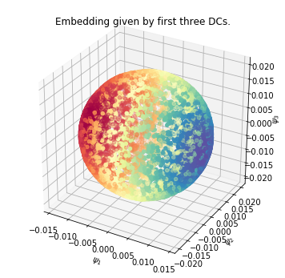

Test if we are able to reproduce spherical harmonics
====================================================

In this notebook we try to reproduce the eigenfunctions of the Laplacian
on the 2D sphere embedded in :math:`\mathbb{R}^3`. The eigenfunctions
are the spherical harmonics :math:`Y_l^m(\theta, \phi)`.

.. code:: python

    import numpy as np
    
    from pydiffmap import diffusion_map as dm
    from scipy.sparse import csr_matrix
    
    np.random.seed(100)
    
    import matplotlib.pyplot as plt
    from mpl_toolkits.mplot3d import Axes3D
    %matplotlib inline

generate data on a Sphere
-------------------------

we sample longitude and latitude uniformly and then transform to
:math:`\mathbb{R}^3` using geographical coordinates (latidude is
measured from the equator).

.. code:: python

    m = 10000
    Phi = 2*np.pi*np.random.rand(m) - np.pi
    Theta = np.pi*np.random.rand(m) - 0.5*np.pi
    X = np.cos(Theta)*np.cos(Phi)
    Y = np.cos(Theta)*np.sin(Phi)
    Z = np.sin(Theta)
    data = np.array([X, Y, Z]).transpose()

run diffusion maps
------------------

Now we initialize the diffusion map object and fit it to the dataset. We
set n_evecs = 4, and since we want to unbias with respect to the
non-uniform sampling density we set alpha = 1.0. The epsilon parameter
controls the scale and is set here by hand. The k parameter controls the
neighbour lists, a smaller k will increase performance but decrease
accuracy.

.. code:: python

    eps = 0.01
    mydmap = dm.DiffusionMap(n_evecs=4, epsilon=eps, alpha=1.0, k=400)
    mydmap.fit_transform(data)
    print(mydmap.epsilon)

.. parsed-literal::

    0.01

The true eigenfunctions here are spherical harmonics
:math:`Y_l^m(\theta, \phi)` and the true eigenvalues are
:math:`\lambda_l = l(l+1)`. The eigenfunction corresponding to
:math:`l=0` is the constant function, which we ommit. Since :math:`l=1`
has multiplicity three, this gives the benchmark eigenvalues [2, 2, 2,
6].

.. code:: python

    real_evals = np.array([2, 2, 2, 6])
    test_evals = -4./eps*(mydmap.evals - 1)
    eval_error = np.abs(test_evals-real_evals)/real_evals
    print(test_evals)
    print(eval_error)

.. parsed-literal::

    [ 1.87120055  1.89337561  1.91161358  5.58725164]
    [ 0.06439973  0.05331219  0.04419321  0.06879139]

visualisation
-------------

We check that we get the correct embedding (which is again a sphere). We
also visualize the eigenfunctions.

.. code:: python

    plt.figure(figsize=(16,6))
    ax = plt.subplot(121, projection='3d')
    ax.scatter(mydmap.dmap[:,0],mydmap.dmap[:,1], mydmap.dmap[:,2], c=Theta, cmap=plt.cm.Spectral)
    ax.set_title('Embedding of sphere')
    ax.set_xlabel(r'$\psi_1$')
    ax.set_ylabel(r'$\psi_2$')
    ax.axis('tight')
    
    ax2 = plt.subplot(122,projection='3d')
    ax2.scatter(X,Y,Z, c=mydmap.dmap[:,0], cmap=plt.cm.Spectral)
    ax2.view_init(45, 60)
    ax2.set_title('sphere dataset, color according to $\psi_1$')
    ax2.set_xlabel('X')
    ax2.set_ylabel('Y')
    ax2.set_zlabel('Z')
    
    plt.show()

Rotating the dataset
--------------------

There is rotational symmetry in this dataset. To remove it, we define
the ‘north pole’ to be the point where the first diffusion coordinate
attains its maximum value.

.. code:: python

    northpole = np.argmax(mydmap.dmap[:,0])
    north = data[northpole,:]
    phi_n = Phi[northpole]
    theta_n = Theta[northpole]
    R = np.array([[np.sin(theta_n)*np.cos(phi_n), np.sin(theta_n)*np.sin(phi_n), -np.cos(theta_n)],
                  [-np.sin(phi_n), np.cos(phi_n), 0],
                 [np.cos(theta_n)*np.cos(phi_n), np.cos(theta_n)*np.sin(phi_n), np.sin(theta_n)]])

.. code:: python

    data_rotated = np.dot(R,data.transpose()).transpose()
    print(data_rotated.shape)

.. parsed-literal::

    (10000, 3)

Now that the dataset is rotated, we can check how well the first
diffusion coordinate approximates the first spherical harmonic
:math:`Y_1^1(\theta, \phi) = \sin(\theta) = Z`.

.. code:: python

    print('Correlation between \phi and \psi_1')
    print(np.corrcoef(mydmap.dmap[:,0], data_rotated[:,2]))
    
    plt.figure(figsize=(16,6))
    ax = plt.subplot(121)
    ax.scatter(data_rotated[:,2], mydmap.dmap[:,0])
    ax.set_title('First DC against $Z$')
    ax.set_xlabel(r'$Z$')
    ax.set_ylabel(r'$\psi_1$')
    ax.axis('tight')
    
    ax2 = plt.subplot(122,projection='3d')
    ax2.scatter(data_rotated[:,0],data_rotated[:,1],data_rotated[:,2], c=mydmap.dmap[:,0], cmap=plt.cm.Spectral)
    #ax2.view_init(75, 10)
    ax2.set_title('sphere dataset rotated, color according to $\psi_1$')
    ax2.set_xlabel('X')
    ax2.set_ylabel('Y')
    ax2.set_zlabel('Z')
    
    plt.show()

.. parsed-literal::

    Correlation between \phi and \psi_1
    [[ 1.          0.99939606]
     [ 0.99939606  1.        ]]

